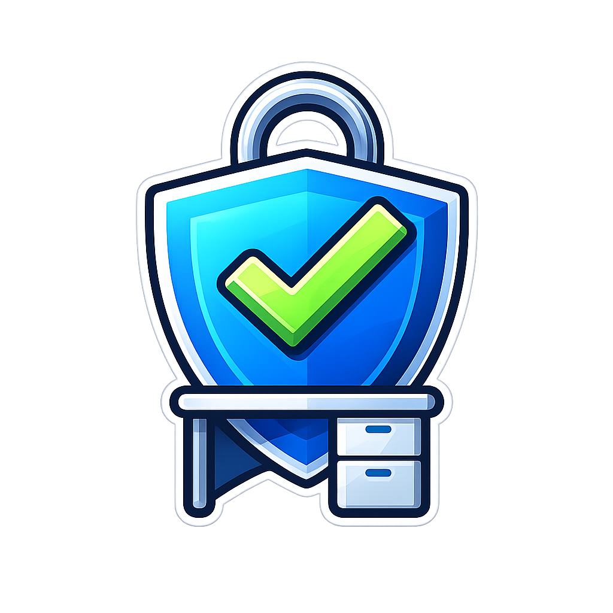

# SecureDesk DAM

<p align="center">
  
</p>

<h1 align="center"><span style="font-size:50px;">SecureDesk DAM</span></h1>

---

## 🚀 Overview

SecureDesk is a ticket management system built with a custom MVC architecture in PHP.  
It provides full lifecycle management of support tickets, including tracking, auditing, reporting, and secure user access control.

---

## ⚠️ Important (Project Delivery)

For the **project delivery**, the application already includes:

- Database created (`securedesk`)
- All required tables
- Initial users
- Seeded tickets data

👉 This allows immediate testing without setup.

⚠️ This applies ONLY to the delivered package.  
If cloned from GitHub, you MUST run initialization scripts.

---

## ⚙️ Setup

### Install dependencies
```
composer install
```
### Run locally

http://localhost/securedesk-dam

---

## 🗄️ Database Initialization
```
cd C:\xampp\htdocs\securedesk-dam
```
```
php config\db_init.php
```

Creates:

- securedesk database
- 7 tables
- 3 users:
  - admin / admin
  - technician / technician
  - reader / reader

---

## 🌱 Seed Data

```
php db/seeds/tickets_seed.php
```

---

## 🧩 Architecture

- MVC pattern (Controllers, Models, Views)
- ViewContext for data flow
- Helpers for security and utilities
- SQLite database

---

## 🔐 Security Features

- CSRF protection
- XSS prevention
- Role-based access control
- Login attempt blocking (5 attempts / 5 min)
- Input validation

---

## 👤 Roles & Permissions

admin → full access  
technician → manage tickets, comments, files, exports  
reader → view + export only

---

## 🧠 Application Features

### 🔑 Authentication

- Login with brute-force protection
- Warning on 4th failed attempt
- Auto block after 5 attempts (5 minutes)

### 📊 Dashboard

- Ticket KPIs (status & priority)
- Category & status distribution
- Quick access filters (critical / unassigned)
- Last update timestamp

### 🎫 Ticket Management

- List, filter and search tickets
- Filters: status, priority, assigned user
- Search: title / description / both
- CSV export (filtered results)

### 🔍 Ticket Detail

- View full ticket info
- Edit ticket (tracked changes)
- Export HTML report
- Export PDF report

### 📎 Attachments

- Upload allowed files (PDF, TXT, PNG)
- File size validation
- Secure storage
- Download files

### 💬 Comments

- Add comments
- View comment history

### 🕓 History Tracking

- Tracks changes in:
  - status
  - priority
  - assigned user

### 👥 Users

- List users
- Filter by role

### 📜 Audit System

Tracks:

- Login / logout
- Failed attempts & blocking
- Ticket creation & updates
- Comments
- File uploads/downloads
- Exports (CSV, PDF, HTML)
- Dashboard access
- Ticket searches
- Password changes

### ⚙️ Profile

- View user data
- Change password with validation:
  - min length
  - upper/lowercase
  - number
  - special char
  - match confirmation

---

## 📂 Project Structure

/config  
/db  
/storage/attachments  
/app  
/public

---

## 🧪 Troubleshooting

- Check Apache/MySQL
- Verify folder name
- Ensure permissions on storage

---

## 🏁 Conclusion

SecureDesk demonstrates a full-stack backend system with strong focus on:

- Clean architecture
- Security
- Data integrity
- Auditability
